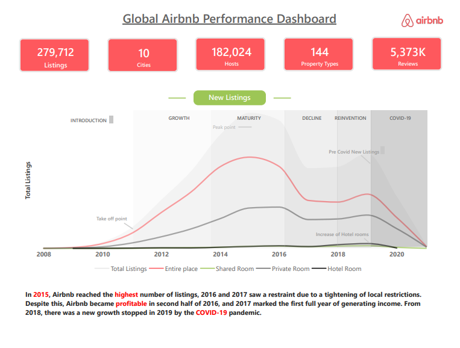
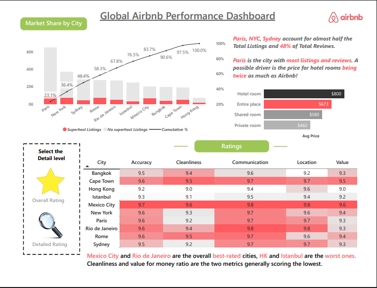
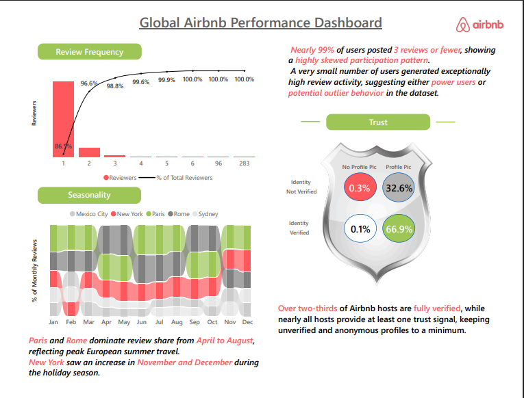

# Global Airbnb Performance Dashboard

An interactive Power BI dashboard analyzing Airbnb business performance, customer behavior, market trends, trust metrics, and seasonal travel patterns across major global cities.

---

## Dashboard File

📥 [Download Power BI Dashboard (.pbix)] https://drive.google.com/file/d/1jYwTI6rm9weQmiyp9mb57_XHDMu65dmG/view?usp=sharing

📄 [View Dashboard PDF] https://drive.google.com/file/d/1Qxx1PbPOptsL0YTuY_qP2ziWXFWG4OPI/view?usp=sharing

---

## Project Overview

This dashboard was built to analyze:

- Airbnb listing growth trends
- City-wise market share
- Customer review behavior
- Ratings and customer satisfaction
- Seasonal travel activity
- Host trust and verification metrics

The project combines business storytelling with advanced Power BI visual analytics and DAX-based insights.

---

## Tools & Technologies

- Power BI
- DAX
- Power Query
- Data Modeling
- Data Visualization

---

## Key Business Insights

- Nearly 99% of users posted 3 reviews or fewer, showing highly skewed participation behavior.
- Paris, New York, and Sydney account for almost half of total listings.
- Mexico City and Rio de Janeiro received the highest overall ratings.
- Over two-thirds of hosts are fully verified.
- Review activity reflects strong seasonal travel behavior.

---

## Dashboard Pages

### 1. Listings Growth Analysis
- Airbnb listing growth from 2008–2020
- COVID-19 impact visualization
- Room-type trend comparison
- Market maturity and decline analysis

### 2. Market Share & Ratings
- City-wise market contribution
- Superhost analysis
- Average pricing comparison
- Ratings heatmap across cities

### 3. Reviews & Trust Analysis
- Pareto analysis of reviewer frequency
- Seasonal review trends
- Host trust verification analysis

---

# Dashboard Preview

## Listings Growth

---

## Market Share & Ratings

---

## Reviews & Trust

---

## Files Included

- Power BI Dashboard (.pbix)
- Dashboard PDF
- Dashboard Screenshots

---

## Author

Chirag Arora